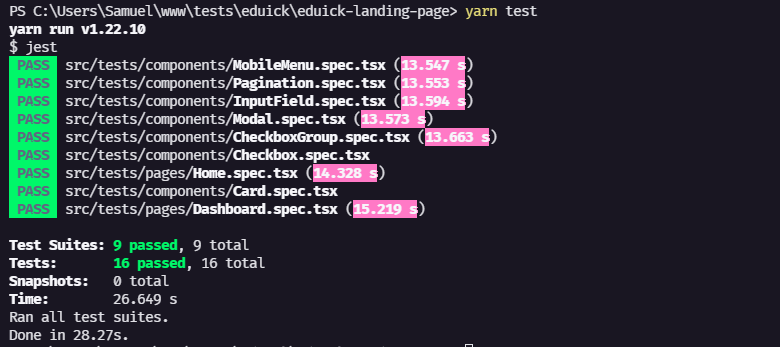

<h1 align="center">
  
</h1>


### 🛠 Tecnologias

- [TypeScript](https://www.typescriptlang.org/)
- [React](https://reactjs.org/)
- [Styled Components](https://styled-components.com/)
- [Next JS](https://nextjs.org/)

#### Pré-requisitos

- [Node.js](https://nodejs.org/en/)

### ✔ Como executar os testes



```bash
# Clone este repositório
$ git clone https://github.com/srsantosdev/eduick-challenge-web

# Acesse a pasta do projeto no terminal
$ cd eduick-challenge-web

# Instale as dependências
$ yarn

# Execute os testes
$ yarn test
```

### 🖥️ Como executar o projeto

```bash
# Clone este repositório
$ git clone https://github.com/srsantosdev/eduick-challenge-web

# Acesse a pasta do projeto no terminal
$ cd eduick-challenge-web

# Instale as dependências
$ yarn

# Execute o servidor
$ yarn server

# Abra um novo terminal
# Execute a aplicação em modo de desenvolvimento
$ yarn dev

# Acesse http://localhost:3000
```

**OBSERVAÇÔES:** Para acessar a dashboard, clique em "Get started" e em seguida no botão "Login".
